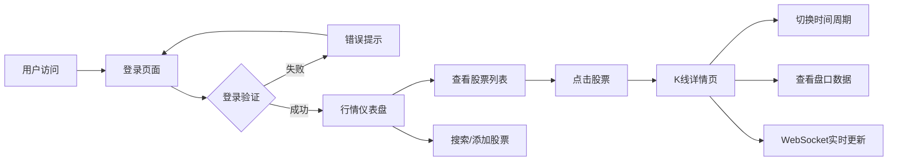

# TqSdk 股票行情前端 - 产品需求文档 (PRD)

## 1. 产品概述

基于 TqSdk 后端的专业股票行情可视化平台，为投资者提供实时行情数据、K线图表分析和股票列表管理。
- 解决投资者快速查看股票行情、分析走势的需求
- 目标用户：个人投资者、股票交易者、金融数据爱好者

## 2. 核心功能

### 2.1 用户角色

| 角色 | 登录方式 | 核心权限 |
|------|----------|----------|
| 普通用户 | TqSdk 账号密码登录 | 查看行情、K线图、订阅股票 |

### 2.2 功能模块

1. **登录页**：账号密码输入、登录验证、错误提示
2. **行情仪表盘**：股票列表、实时价格、涨跌幅、成交量
3. **K线详情页**：K线图表、分时切换、技术指标、盘口数据
4. **股票搜索/添加**：合约查询、一键订阅、订阅管理

### 2.3 页面详情

| 页面名称 | 模块名称 | 功能描述 |
|----------|----------|----------|
| 登录页 | 登录表单 | 账号输入、密码输入、登录按钮、错误提示、品牌展示 |
| 行情仪表盘 | 顶部导航 | 用户信息、退出登录、搜索框、实时状态指示 |
| 行情仪表盘 | 股票列表 | 股票代码、名称、最新价、涨跌幅、涨跌额、成交量、成交额 |
| 行情仪表盘 | 行情卡片 | 自选股概览、涨跌分布、市场概览 |
| K线详情页 | K线主图 | 蜡烛图、成交量柱状图、均线、时间周期切换 |
| K线详情页 | 盘口信息 | 买一到买五、卖一到卖五、最新价、今开、最高、最低 |
| K线详情页 | 交易信息 | 成交量、成交额、换手率、市盈率等基本信息 |
| 股票搜索 | 搜索面板 | 按交易所/品种筛选、搜索结果列表、一键订阅 |

## 3. 核心流程

## 4. 用户界面设计

### 4.1 设计风格

- **主色调**：深邃夜空蓝 (#0a0e1a) 作为背景，金融绿 (#00d4aa) 涨、金融红 (#ff4757) 跌
- **辅助色**：青色 (#00d4ff) 强调、琥珀色 (#ffaa00) 警示
- **风格**：深色金融科技风，专业、冷静、数据驱动
- **字体**：现代无衬线字体，数字使用等宽字体增强可读性
- **按钮**：圆角 8px，主按钮渐变效果，悬停有微动画
- **布局**：卡片式布局，玻璃态效果，深色背景 + 数据高亮
- **图标**：简洁线性图标，与金融主题匹配

### 4.2 页面设计概览

| 页面名称 | 模块名称 | UI 元素 |
|----------|----------|---------|
| 登录页 | 登录卡片 | 渐变背景、玻璃态登录框、品牌 Logo、输入框动效、错误抖动 |
| 行情仪表盘 | 顶部栏 | 固定顶部、搜索框、状态指示灯、用户菜单 |
| 行情仪表盘 | 股票列表 | 斑马纹行、涨跌颜色区分、悬停高亮、点击进入详情 |
| 行情仪表盘 | 市场概览 | 大盘指数卡片、涨跌统计、资金流向 |
| K线详情页 | K线图 | 蜡烛图、成交量副图、时间周期切换按钮组 |
| K线详情页 | 盘口面板 | 五档买卖盘、红绿深浅表示量能 |
| K线详情页 | 实时数据 | 价格跳动动画、成交量脉冲效果 |

### 4.3 响应式

- 桌面端优先设计，宽度 1280px 以上最佳体验
- 平板端：股票列表单列、K线自适应宽度
- 移动端：底部导航、垂直滚动、简化信息

### 4.4 动效与交互

- 登录页：卡片入场动画、输入框聚焦发光
- 行情更新：价格数字跳动、涨跌幅闪烁
- K线图：数据加载骨架屏、实时推送平滑过渡
- 页面切换：淡入淡出过渡
- 悬停效果：卡片微上浮、按钮发光
