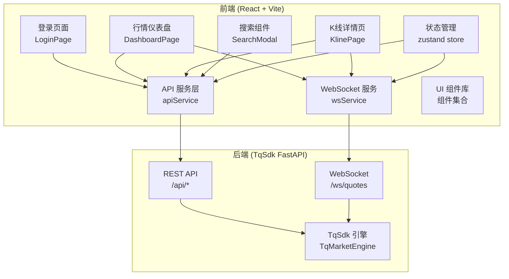
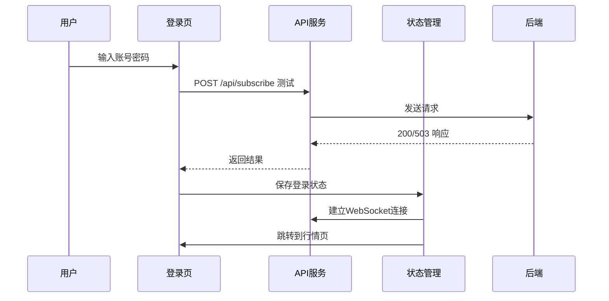

# TqSdk 股票行情前端 - 技术架构文档

## 1. 架构设计



## 2. 技术栈描述

- **前端框架**：React 18 + TypeScript
- **构建工具**：Vite 5
- **样式方案**：Tailwind CSS 3
- **状态管理**：Zustand
- **路由**：React Router v6
- **图表库**：ECharts 5（K线图、成交量图）
- **HTTP 客户端**：Axios
- **WebSocket**：原生 WebSocket API + 重连机制
- **图标**：Lucide React
- **日期处理**：dayjs

## 3. 路由定义

| 路由 | 页面 | 说明 |
|------|------|------|
| `/login` | 登录页 | TqSdk 账号密码登录 |
| `/` | 行情仪表盘 | 股票列表、市场概览 |
| `/stock/:symbol` | K线详情页 | K线图、盘口数据、交易信息 |

## 4. API 定义

### 4.1 类型定义

```typescript
// 行情数据
interface QuoteData {
  symbol: string;
  datetime: string | null;
  instrument_name: string | null;
  last_price: number | null;
  ask_price1: number | null;
  ask_volume1: number | null;
  bid_price1: number | null;
  bid_volume1: number | null;
  open: number | null;
  high: number | null;
  low: number | null;
  close: number | null;
  average: number | null;
  volume: number | null;
  amount: number | null;
  open_interest: number | null;
  price_tick: number | null;
  volume_multiple: number | null;
  highest: number | null;
  lowest: number | null;
  expired: boolean | null;
}

// K线数据
interface KlineData {
  datetime: string;
  open: number;
  high: number;
  low: number;
  close: number;
  volume: number;
  open_oi: number | null;
  close_oi: number | null;
}

interface KlineResponse {
  symbol: string;
  duration_seconds: number;
  data: KlineData[];
}

// Tick数据
interface TickData {
  datetime: string;
  last_price: number | null;
  ask_price1: number | null;
  bid_price1: number | null;
  highest: number | null;
  lowest: number | null;
  volume: number | null;
  amount: number | null;
  open_interest: number | null;
}

// 合约信息
interface SymbolInfo {
  symbol: string;
  instrument_name: string | null;
  ins_class: string | null;
  exchange_id: string | null;
  price_tick: number | null;
  volume_multiple: number | null;
}

// 健康检查
interface HealthResponse {
  status: 'ok' | 'degraded' | 'unavailable';
  engine_ready: boolean;
  error: 'auth_missing' | 'auth_failed' | 'connect_timeout' | null;
  subscribed_symbols: string[];
  last_update_at: string | null;
}

// WebSocket消息
interface WsMessage {
  type: 'quote_update' | 'subscribe_result' | 'unsubscribe_result' | 'ping' | 'pong' | 'error';
  data?: any;
  subscribed?: string[];
  already_subscribed?: string[];
  unsubscribed?: string[];
  not_subscribed?: string[];
  message?: string;
}
```

### 4.2 REST API 列表

| 方法 | 路径 | 说明 |
|------|------|------|
| GET | `/api/health` | 健康检查 |
| POST | `/api/subscribe` | 订阅行情 |
| DELETE | `/api/unsubscribe` | 取消订阅 |
| GET | `/api/quote/:symbol` | 获取单个行情 |
| GET | `/api/quotes` | 获取所有已订阅行情 |
| GET | `/api/klines/:symbol` | 获取K线数据 |
| GET | `/api/ticks/:symbol` | 获取Tick数据 |
| GET | `/api/symbols` | 已订阅合约列表 |
| POST | `/api/query_symbols` | 查询合约 |

## 5. 数据模型

### 5.1 状态管理 (Zustand Store)

```typescript
interface AppState {
  // 认证
  isAuthenticated: boolean;
  username: string | null;
  
  // 行情数据
  quotes: Record<string, QuoteData>;
  subscribedSymbols: string[];
  
  // 当前选中
  currentSymbol: string | null;
  
  // 方法
  login: (username: string, password: string) => Promise<boolean>;
  logout: () => void;
  subscribe: (symbols: string[]) => Promise<void>;
  unsubscribe: (symbols: string[]) => Promise<void>;
  setCurrentSymbol: (symbol: string) => void;
  updateQuote: (quote: QuoteData) => void;
}
```

### 5.2 WebSocket 连接状态

- `connecting`：连接中
- `connected`：已连接
- `disconnected`：已断开
- `reconnecting`：重连中

## 6. 核心模块设计

### 6.1 API 服务层 (apiService)

- 统一的 axios 实例配置
- 请求/响应拦截器
- 所有 REST API 封装方法

### 6.2 WebSocket 服务 (wsService)

- 单例 WebSocket 连接管理
- 自动重连（指数退避）
- 心跳机制
- 消息分发
- 事件订阅/取消订阅

### 6.3 K线图组件

- 基于 ECharts 的蜡烛图
- 成交量副图
- 时间周期切换（1分、5分、15分、30分、1小时、日K）
- 实时数据更新
- 十字光标、详情提示框

### 6.4 登录流程



## 7. 性能优化

- 股票列表虚拟滚动（数据量大时）
- K线数据懒加载
- WebSocket 消息节流与合并
- React.memo 减少不必要重渲染
- 图表数据增量更新
